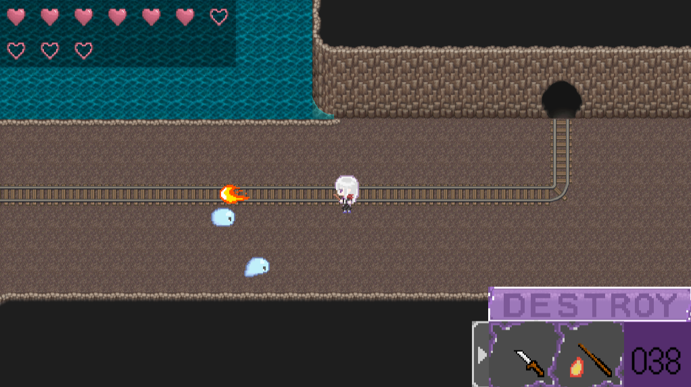

# 2Dアクションゲーム「魔石鉱道」のソースコード
本リポジトリはフリーゲーム「魔石鉱道」で使用したプロジェクトをまとめたものである。

# ゲームの概要
このゲームは鉱道に迷いこんだ旅人リースを導き、出口を目指すアクションゲームとなっている。魔法や道具を使い、鉱道内の仕掛けを紐解いていくのが醍醐味のゲームである。

# 注意点
&emsp;本ゲームはml-agentsを使用している。当プロジェクトで学習を行うには、パッケージとしてmlagents及びmlagents-extension、barracudaをインポートする必要がある。デフォルトでは、github上から取得したmlagents、barracudaのアセットはCドライブ直下のUnityPackageフォルダ内にまとめてあることを想定している。(例：C:\UnityPackage\barracuda-release-release-3.0.1)  
&emsp;また、githubへの投稿の都合上100Mbを超えるファイルはアップロードできないため、__Asset/Font内に存在したファイルはすべて取り除いてある__。そのため当プロジェクトを正確に動かすには、UnityのFont Asset Creatorを用いてフォント(*.assetファイル)を用意する必要がある。本ゲームでは、"https://fonts.google.com/specimen/DotGothic16" から取得したフォントを用いて作成している。

# 作成情報
* 制作者: スカキヨ
* email: sukasukakiyokiyo@gmail.com

# 使用ツール
## Unity 2021.3.25f1
&emsp;ゲームエンジンとして使用。本リポジトリに保存したファイルはUnityで使用することを前提として作られている。  
barracuda:https://github.com/Unity-Technologies/barracuda-release/tree/release/3.0.1  
ML-Agents:https://github.com/Unity-Technologies/ml-agents/tree/release_20